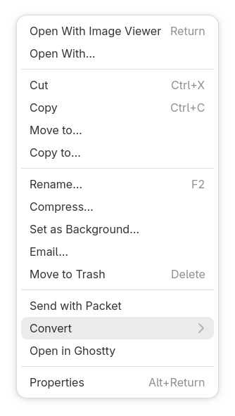

# Nautilus Media Converter

A Nautilus extension that adds a context menu option to convert image and video files to various formats.

## Dependencies

* python3-nautilus
* ffmpeg
* imagemagick
* libnotify-bin
* python3-gobject
* libadwaita

## Installation

1. Create the extensions directory:
mkdir -p ~/.local/share/nautilus-python/extensions

2. Copy or symlink the extension and progress script:
ln -sf $PWD/media_converter.py ~/.local/share/nautilus-python/extensions/
ln -sf $PWD/adw_progress.py ~/.local/share/nautilus-python/extensions/

3. Restart Nautilus:
nautilus -q

## Usage

Select an image or video file in Nautilus. Right click and choose Convert to select a target format.

Supported image output formats: PNG, JPG, WEBP, GIF
Supported video output formats: MP4, MKV, WEBM, GIF
